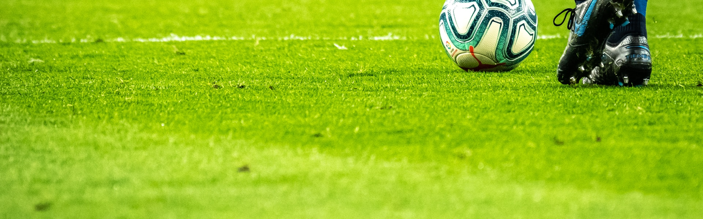

# AI Image Generation Plan for FANTOWNS

## 🎨 Image Inventory & Replacement Strategy

### Current State:
- **Emojis everywhere**: 🏙️ ⚽ 🍺 🎵 (works but not professional)
- **SVG placeholders**: Open Graph images with emojis
- **No hero images**: City pages have no visual headers
- **YouTube thumbnails only**: For video content

---

## 📸 Images Needed (Priority Order)

### HIGH PRIORITY (Core Visual Identity)

#### 1. **City Hero Images** (21 images)
**Purpose**: Large banner images for each city page
**Specs**: 1920x600px, landscape, dramatic
**Style**: Photorealistic, cinematic, vibrant
**AI Prompts**:
- Liverpool: "Cinematic wide shot of Anfield stadium at sunset, red glow, passionate crowd silhouettes, You'll Never Walk Alone banner, dramatic lighting"
- Tokyo: "Neon-lit Akihabara at night, anime billboards, bustling crowds in cosplay, vibrant colors, cyberpunk aesthetic"
- Buenos Aires: "La Bombonera stadium exterior with passionate Boca Juniors fans, blue and yellow smoke, dramatic Argentine sunset"
- [etc. for all 21 cities]

#### 2. **Logo/Brand Mark** (1 image)
**Purpose**: Replace 🏙️ emoji with professional logo
**Specs**: 512x512px, transparent PNG, works on dark/light backgrounds
**Style**: Modern, bold, iconic
**AI Prompt**: "Minimalist logo design for FANTOWNS, stylized city skyline with stadium elements, bold typography, vibrant gradient blue to purple, flat design, transparent background"

#### 3. **Homepage Hero Image** (1 image)
**Purpose**: Main landing page background
**Specs**: 1920x1080px, full-width hero
**Style**: Montage/collage feel, energetic
**AI Prompt**: "Epic montage of world's most passionate sports fans - football ultras, anime convention crowds, stadium atmospheres, from Liverpool to Tokyo to Buenos Aires, vibrant colors, dynamic composition, cinematic lighting"

### MEDIUM PRIORITY (Enhanced UX)

#### 4. **Category Icons** (8 images)
**Purpose**: Replace emoji category badges (🏟️ 🔥 😱 etc.)
**Specs**: 256x256px, PNG with transparency
**Style**: Flat design, colorful, consistent style
**Categories**: Stadium Tours, Match Atmosphere, Fan Reactions, City Guides, Chants & Songs, Food & Drink, Fan Culture, Highlights

#### 5. **Blog Post Headers** (8 images)
**Purpose**: Featured images for each blog story
**Specs**: 1200x630px, landscape
**Style**: Photorealistic scenes matching story location
**Example Prompts**:
- Anfield story: "Liverpool FC Anfield Kop stand filled with 54,000 fans, scarves raised, dramatic red lighting, emotional atmosphere"
- Yellow Wall story: "Dortmund Signal Iduna Park, 25,000 fans in yellow, bouncing in unison, wide angle shot"

#### 6. **Social Sharing Images** (Open Graph)
**Purpose**: Better social media previews
**Specs**: 1200x630px per city/page
**Style**: Branded template with city imagery

### LOW PRIORITY (Polish)

#### 7. **City Icons/Thumbnails** (21 images)
**Purpose**: Small icons for city cards on homepage
**Specs**: 400x400px, square
**Style**: Iconic landmarks or symbols per city

#### 8. **Loading/Placeholder Images**
**Purpose**: Skeleton screens while content loads
**Specs**: Various sizes
**Style**: Blurred, low-res versions

---

## 🛠️ Implementation Approach

### Option A: External AI Image Services (Recommended)

**Tools to Use**:
1. **Midjourney** (Best quality, $10-30/mo)
   - Photorealistic city scenes
   - Cinematic atmospheres
   - Hero images

2. **DALL-E 3** (via ChatGPT Plus, $20/mo)
   - Logos and icons
   - Consistent style across sets
   - Text integration

3. **Stable Diffusion** (Free, self-hosted)
   - Unlimited generations
   - Full control
   - Requires technical setup

4. **Leonardo.ai** (Free tier available)
   - Game-like illustrations
   - Consistent character/style
   - Good for icons

**Recommended Workflow**:
```
1. Generate images using Midjourney/DALL-E
2. Download high-res versions
3. Optimize with TinyPNG or Squoosh
4. Upload to /images/ directory
5. Update HTML/CSS references
```

### Option B: Programmatic Generation (Advanced)

Use Replicate API or Stability AI API to generate on-demand:
```javascript
// Example with Replicate API
const response = await replicate.run(
  "stability-ai/sdxl",
  {
    input: {
      prompt: "Cinematic Liverpool Anfield stadium sunset...",
      width: 1920,
      height: 600
    }
  }
);
```

---

## 📁 File Structure

```
/fantowns/
├── images/
│   ├── heroes/
│   │   ├── liverpool-hero.jpg (1920x600, ~200KB)
│   │   ├── tokyo-hero.jpg
│   │   └── ... (21 total)
│   ├── icons/
│   │   ├── logo.png (512x512, transparent)
│   │   ├── category-stadium.png
│   │   ├── category-atmosphere.png
│   │   └── ... (8 total)
│   ├── blog/
│   │   ├── anfield-pilgrimage.jpg (1200x630)
│   │   └── ... (8 total)
│   ├── og/
│   │   ├── liverpool-og.jpg (1200x630)
│   │   └── ... (21 total)
│   └── thumbnails/
│       ├── liverpool-thumb.jpg (400x400)
│       └── ... (21 total)
```

---

## 💾 Image Optimization

### Before Upload:
1. **Compress**: Use TinyPNG, Squoosh, or ImageOptim
2. **Format**:
   - JPG for photos (80-85% quality)
   - PNG for logos/icons with transparency
   - WebP for modern browsers (fallback to JPG)
3. **Responsive sizes**:
   - Generate 1x, 2x versions for retina
   - Use srcset for different screen sizes

### HTML Implementation:
```html
<!-- Hero with srcset -->


<!-- Logo with fallback -->
<picture>
  <source srcset="images/icons/logo.webp" type="image/webp">
  
</picture>
```

---

## 🎨 Detailed AI Prompts for Each City

### Liverpool
```
Hero: "Cinematic wide shot of Anfield stadium at golden hour, dramatic red sky, 54,000 passionate Liverpool fans with scarves raised, You'll Never Walk Alone banner visible, photorealistic, volumetric lighting, 8k quality"

Thumbnail: "Iconic Liverpool liver bird symbol in red, minimalist flat design, circular badge style"

OG Image: "Split view: Left shows Anfield Kop stand, right shows Liverpool city waterfront, FANTOWNS logo overlay, vibrant red color scheme"
```

### Tokyo
```
Hero: "Neon-soaked Akihabara street at night, massive anime billboards, crowds of cosplayers, electric town signage, cyberpunk atmosphere, vibrant pink and blue neon, ultra wide angle, photorealistic"

Thumbnail: "Stylized Tokyo tower with anime elements, flat design, vibrant colors, circular icon"

OG Image: "Comiket convention hall packed with 750,000 attendees, colorful cosplay, FANTOWNS branding, electric atmosphere"
```

### Buenos Aires
```
Hero: "La Bombonera stadium exterior during Boca Juniors match, passionate fans waving blue and yellow flags, thick colored smoke, dramatic Argentine sunset, vibrant atmosphere, cinematic composition"

Thumbnail: "Boca Juniors La Bombonera stadium icon, blue and yellow color scheme, flat design badge"

OG Image: "Superclásico derby scene, split Boca vs River Plate, intense crowd, Argentine flag colors, FANTOWNS overlay"
```

### Dortmund
```
Hero: "Signal Iduna Park Yellow Wall, 25,000 fans in yellow bouncing in unison, massive tifos, ultra wide shot, dramatic lighting, sea of yellow and black, photorealistic stadium atmosphere"

Thumbnail: "Borussia Dortmund yellow wall icon, black and yellow stripes, circular badge"

OG Image: "Yellow Wall choreography from aerial view, synchronized fans, Bundesliga atmosphere"
```

### Green Bay
```
Hero: "Lambeau Field in winter, snow falling, fans tailgating in Packers gear, frozen tundra, brats grilling in snow, dramatic Wisconsin winter sky, photorealistic cold weather atmosphere"

Thumbnail: "Lambeau Field frozen tundra icon, green and gold Packers colors, circular badge"

OG Image: "Titletown experience, snow-covered stadium, passionate winter fans, cheese heads visible"
```

[Continue for remaining 16 cities...]

---

## 🚀 Implementation Code

### 1. Update city.html to use hero images:

```javascript
// In city.html, update hero section
const cityData = CITY_DATA[cityName];

// Set hero background image
document.querySelector('.hero-city').style.backgroundImage =
  `linear-gradient(rgba(0,0,0,0.4), rgba(0,0,0,0.6)),
   url('images/heroes/${cityName}-hero.jpg')`;

// Set OG image
const ogImage = document.querySelector('meta[property="og:image"]');
if (ogImage) {
  ogImage.setAttribute('content', `https://www.fantowns.com/images/og/${cityName}-og.jpg`);
}
```

### 2. Update index.html for city cards:

```javascript
// Replace emoji icons with actual images
function createCityCard(city) {
  return `
    <div class="city-card" onclick="goToCity('${city.id}')">
      <div class="city-card-image">
        
      </div>
      <div class="city-card-content">
        <h3>${city.name}</h3>
        <p>${city.tagline}</p>
      </div>
    </div>
  `;
}
```

### 3. Create image preload utility:

```javascript
// Add to components.js
function preloadCriticalImages() {
  const criticalImages = [
    'images/icons/logo.png',
    'images/heroes/homepage-hero.jpg'
  ];

  criticalImages.forEach(src => {
    const link = document.createElement('link');
    link.rel = 'preload';
    link.as = 'image';
    link.href = src;
    document.head.appendChild(link);
  });
}
```

---

## 📊 Expected File Sizes & Performance

### Total Image Library:
- 21 city heroes (1920x600): ~200KB each = 4.2MB
- 21 city thumbnails (400x400): ~50KB each = 1.05MB
- 21 OG images (1200x630): ~150KB each = 3.15MB
- 8 blog headers (1200x630): ~150KB each = 1.2MB
- 8 category icons (256x256): ~20KB each = 160KB
- 1 logo (512x512): ~30KB
- 1 homepage hero (1920x1080): ~300KB

**Total**: ~10MB uncompressed
**After optimization**: ~5-6MB
**With WebP**: ~3-4MB

### Performance Impact:
- Lazy loading: Only load visible images
- Critical path: Homepage hero + logo = ~330KB
- Per city page: Hero + thumbnails = ~250KB
- Overall: Manageable with proper optimization

---

## ⚡ Quick Start Action Plan

### Week 1: Core Identity
1. Generate logo (replace 🏙️)
2. Generate homepage hero
3. Implement on index.html
4. Test loading performance

### Week 2: City Heroes
1. Generate 21 city hero images
2. Optimize and upload
3. Update city.html background system
4. Test on mobile

### Week 3: Supporting Images
1. Generate category icons
2. Generate blog headers
3. Generate OG images
4. Update all references

### Week 4: Polish & Optimize
1. Add WebP versions
2. Implement lazy loading everywhere
3. Add image srcset for responsive
4. Performance audit

---

## 🎯 Recommended AI Image Services

### For FANTOWNS specifically:

1. **Midjourney** ($30/mo Standard Plan)
   - Best for: City heroes, photorealistic scenes
   - Quality: Exceptional
   - Prompt: `/imagine cinematic Liverpool Anfield stadium...`

2. **DALL-E 3** (ChatGPT Plus $20/mo)
   - Best for: Logo, icons, consistent style
   - Quality: Very good, especially for design elements
   - Access via ChatGPT interface

3. **Leonardo.ai** (Free tier: 150 images/day)
   - Best for: Rapid iteration, multiple variations
   - Quality: Good
   - Great for testing concepts

### My Recommendation:
- **Month 1**: Use Leonardo.ai free tier to test all concepts
- **Month 2**: Subscribe to Midjourney for final high-quality versions
- **Total cost**: $30 one-time (can cancel after generating all images)

---

## 📋 Image Generation Checklist

```markdown
### Logo & Branding
- [ ] Main logo (512x512 PNG transparent)
- [ ] Logo variations (light/dark backgrounds)
- [ ] Favicon (32x32)

### Heroes (1920x600)
- [ ] Liverpool
- [ ] Tokyo
- [ ] Buenos Aires
- [ ] Dortmund
- [ ] Green Bay
- [ ] Manchester
- [ ] Barcelona
- [ ] Istanbul
- [ ] Nashville
- [ ] Glasgow
- [ ] São Paulo
- [ ] Seattle
- [ ] Munich
- [ ] Cairo
- [ ] Madrid
- [ ] Marseille
- [ ] Mexico City
- [ ] New Orleans
- [ ] Portland
- [ ] Melbourne
- [ ] Athens

### Category Icons (256x256)
- [ ] Stadium Tours
- [ ] Match Atmosphere
- [ ] Fan Reactions
- [ ] City Guides
- [ ] Chants & Songs
- [ ] Food & Drink
- [ ] Fan Culture
- [ ] Highlights

### Blog Headers (1200x630)
- [ ] Anfield Pilgrimage
- [ ] Dortmund Yellow Wall
- [ ] Tokyo Comiket
- [ ] Green Bay Frozen Tundra
- [ ] La Bombonera
- [ ] Nashville Honky Tonks
- [ ] Seattle 12th Man
- [ ] Athens Gate 7

### Open Graph (1200x630)
- [ ] All 21 cities
- [ ] Blog page
- [ ] Videos page
- [ ] Homepage
```

---

## 🔄 Want me to implement the image system?

Once you generate the images (or want me to help with prompts), I can:

1. Create the `/images/` directory structure
2. Update all HTML files to use real images
3. Implement lazy loading
4. Add responsive srcset
5. Create image optimization scripts
6. Update CSS for proper sizing
7. Add fallbacks for failed loads

Just let me know when you have images ready or if you want detailed prompts for specific cities!
